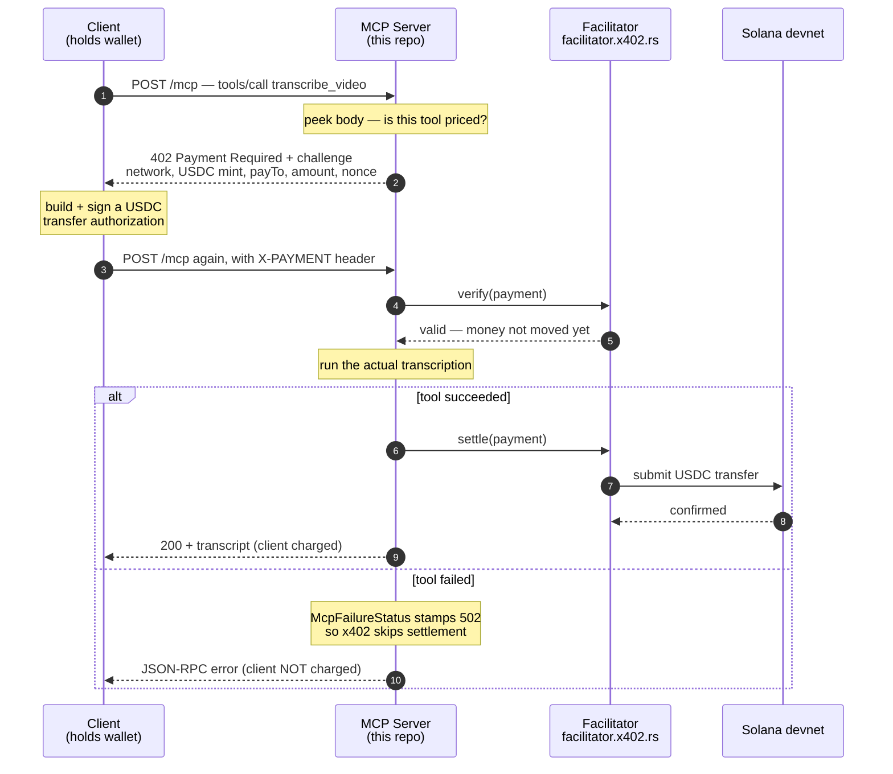
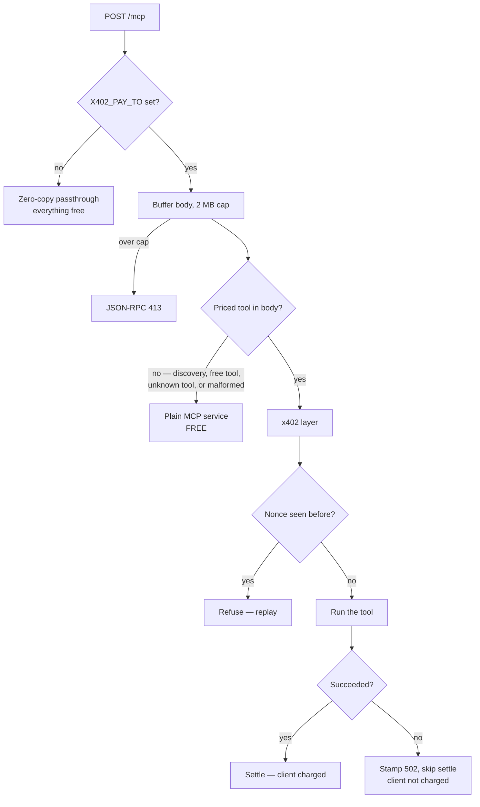
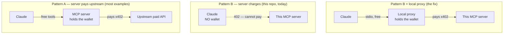

# x402 MCP Payments — Handoff

Branch: `feat/x402-mcp-payments`
Written: 2026-08-06

Read this first in a new session. It states where the branch stands, what is
already done (so you don't redo it), what is genuinely missing, and the traps
that already cost time.

---

## 1. TL;DR

The **server is done and well tested**. The **paying client now exists too** —
built as a separate repo, `x402-mcp-proxy` (see §4.1). There was no rework; the
client was always additive.

**The zero-spend dry run passed** (2026-08-07). Proxy → server, live, with
`--max-payments 0`:

- `initialize` and `tools/list` round-tripped; the catalogue showed
  `COST: $0.20 USDC per call`
- `notifications/initialized` correctly produced no reply
- session propagation and SSE unwrapping both worked
- `tools/call` was refused at the proxy with a well-formed JSON-RPC error
- the 402 challenge is confirmed **v2 on the wire**: `"x402Version": 2`,
  `"network": "solana:EtWTRABZaYq6iMfeYKouRu166VU2xqa1"`, amount `"200000"`
  ($0.20 at USDC's 6 decimals), devnet USDC mint, and
  `"extra": {"feePayer": ...}` — the facilitator sponsoring the network fee

**What remains: one real payment.** Nothing has yet settled on chain, because
that needs a payer funded with devnet USDC. Everything up to the moment money
moves is now verified.

Next step: fund a payer and run with `--max-payments 1` (see §4.2).

---

## 2. What this branch does

Pay-per-call gating for the MCP endpoint using x402 (HTTP 402 + USDC on Solana
devnet), settled through a hosted facilitator.

Design rule: **free discovery, paid execution**. `initialize`, `tools/list`,
`resources/list`, `prompts/list` and notifications stay free; only `tools/call`
for a priced tool is gated. An agent that can't read the catalogue can never
decide to buy from it.

Currently priced: `transcribe_video` at `$0.20` (`PRICED_TOOLS`,
`src/x402_mcp.rs:87`).

### Request flow

```
client                    this server                 facilitator      chain
  │  POST tools/call          │                            │             │
  ├──────────────────────────>│ peek body: priced tool?    │             │
  │  402 + challenge          │ (discovery bypasses, free) │             │
  │<──────────────────────────┤                            │             │
  │                           │                            │             │
  │  sign USDC authorization  │                            │             │
  │  POST + X-PAYMENT header  │                            │             │
  ├──────────────────────────>│  verify ──────────────────>│             │
  │                           │<───────────────── ok       │             │
  │                           │ run transcription          │             │
  │                           │ (McpFailureStatus stamps   │             │
  │                           │  failures 502 → no settle) │             │
  │                           │  settle ──────────────────>│──── tx ────>│
  │  200 + result             │                            │             │
  │<──────────────────────────┤                            │             │
```

Same flow as a Mermaid sequence diagram:



The two-phase split — **verify** then **settle**, with the work in between — is
the whole reason this module exists. It's what lets a failed transcription cost
the caller nothing.

### Which requests actually pay



Note that malformed and unknown bodies fail **open** (free), never closed. A
parse bug can't accidentally bill someone.

**This server never touches Solana.** No keypair, no transaction, no RPC. It
names a price and a `payTo` address; `x402-axum` delegates every crypto
operation to the facilitator. All Solana work happens in the *client*.

That is why the Solana CLI is not a useful entry point for this branch — see
§7.

---

## 3. Current state — DONE, do not redo

### Server implementation (`src/x402_mcp.rs`, ~1053 lines)

Read the module-level doc comment (lines 1–59) first. It explains every design
decision and is accurate.

| Piece | Line | What it does |
|---|---|---|
| `PRICED_TOOLS` | 87 | single source of truth for pricing |
| `priced_tool_in_body` | 111 | peeks JSON-RPC body to decide free vs paid |
| `payment_settings` | 175 | reads env, returns `None` when payments are off |
| `layer_from_env` | 207 | builds the `x402-axum` layer |
| `NonceGuard` / `NonceClaim` | 246 / 314 | one execution per payment nonce; `Drop` releases on unwind |
| `McpFailureStatus` | 377 | re-stamps failed tool calls as 502 so x402 skips settlement, then restores the original status |
| `body_reports_tool_failure` | 484 | detects both `result.isError` and top-level JSON-RPC `error`, in JSON and SSE framing |
| `X402McpRouter` | 529 | routes each request to the plain or paid service |

Wired at `src/mcp/server_rmcp.rs:48` — advertises `COST: $x USDC per call` in
the tool catalogue when payments are on.

**Protocol version: x402 v2** (`V2SolanaExact::price_tag`). v2 identifies the
network by CAIP-2 chain id rather than v1's `"solana-devnet"` string. All three
parties must agree on the version — this server, the client in
`x402-mcp-proxy`, and the facilitator's `schemes` entry
(`"scheme": "v2-solana-exact"`). Migrated from v1 on 2026-08-07 because the
facilitator's documented config only shows v2; both sides moved together and
their suites still pass (28 + 7). `PaymentSettings::network()` still returns
the human-readable `"solana-devnet"`, which is display-only (catalogue text and
logs) and not on the wire.

### Tests — 28 unit tests in `src/x402_mcp.rs`, all passing

Already covered, **do not rewrite**:

- Pricing/gating: priced vs free tools, discovery methods never priced,
  unknown tools, malformed bodies fail *open* (free), batches containing a
  priced call, empty batches
- `NonceGuard`: admitted once then refused, concurrent claims admit exactly
  one, released nonce reclaimable, releasing an unknown nonce is harmless,
  uncommitted claim released on drop, committed claim retained, claim dropped
  during unwind releases
- Failure detection: both JSON and SSE framing, top-level JSON-RPC error,
  `null` error field is not a failure, successful results still settle, and the
  false-positive case where transcript text itself quotes `isError`

### `scripts/x402-check.sh`

Runtime smoke check. Verifies the free path, that the catalogue advertises the
price (and doesn't when payments are off), and asserts the 402 challenge amount.
It **cannot pay** — see its own note at line 191.

Usage: `X402_PAY_TO=<solana-address> scripts/x402-check.sh`

---

## 4. What is actually missing

### 4.1 A paying client — BUILT

Lives at **`/Users/nhatvu148/Work/my-apps/x402-mcp-proxy`** (separate repo,
initial commit `d4fcb2f`). Not in this repo deliberately: this crate depends on
`whisper-rs` with Metal, and nobody installing a small stdio forwarder should
have to compile whisper.cpp.

Built on `x402-reqwest = "2.0.2"` — same version family as this server's deps.
Status: compiles, 7 unit tests pass, clippy and fmt clean. **Never run against
a live server.**

**Gotcha found while building it:** the docs.rs example for
`V1SolanaExactClient::new` is wrong. The real signature is

```rust
pub fn new(signer: S, rpc_client: R) -> Self
```

so the *client* needs its own Solana RPC endpoint to build and simulate the
USDC authorization. This server stays RPC-free; the client does not. Both
generics are `Clone`-bound, hence `Arc<Keypair>` and `Arc<RpcClient>`.

### 4.2 One real payment — THE REMAINING GAP

Everything short of money moving is verified (§1). What's left needs a funded
payer:

```bash
# 1. payer wallet — --derivation-path matters, see §7
solana-keygen new --derivation-path -o payer.json
solana address -k payer.json

# 2. fund with devnet USDC (manual — needs a login)
#    https://faucet.circle.com → "Solana Devnet"
spl-token accounts --url devnet          # confirm USDC arrived, not SOL

# 3. server on, then one paid call through the proxy
X402_PAY_TO=<your-address> ./target/debug/video-transcriber-mcp \
  --transport http --port 8080

x402-mcp-proxy --url http://127.0.0.1:8080/mcp \
  --keypair payer.json --max-payments 1
```

Expect `settled payment 1/1` on the proxy's stderr, and the payer's USDC
balance down by 0.20.

Then promote it to `tests/x402_payment_e2e.rs`, `#[ignore]`d and gated on an
env var such as `X402_E2E_PAYER=/path/to/payer.json` — CI must not depend on a
faucet.

Worth testing deliberately once paying works: a **failing** tool call must not
settle. That is what `McpFailureStatus` exists for, it is unit-tested, but it
has never been observed against a real facilitator.

### 4.3 Claude Code integration — needs a proxy

**Claude Code cannot pay.** Verified: `claude mcp add` supports only OAuth
(`--client-id`, `--client-secret`, `--callback-port`) and static headers (`-H`).
No wallet, no signer, no 402 handling.

A static `-H "X-PAYMENT: ..."` is **not** a workaround: the header carries a
per-challenge nonce and a fresh signature, so a pinned value is a replay —
and `NonceGuard` is specifically built to refuse it.

What happens today if you connect Claude: `initialize` and `tools/list` work
(free discovery), Claude sees the catalogue with `COST:` labels, and
`tools/call` returns 402 as an error. Graceful degradation, but unusable.

**Fix — a local paying proxy:**

```
Claude Code ──stdio──> local proxy (holds wallet) ──HTTP+X-PAYMENT──> this server
                free                                      paid
```

A small stdio MCP server that forwards JSON-RPC over HTTP using
`x402-reqwest`. Claude adds it with a plain `claude mcp add`, and never knows
payment happened.

**This is the same client as §4.1** — built, see that section. Beyond the x402
protocol (handled by `x402-reqwest`) it implements three things this server's
transport requires:

- `Mcp-Session-Id` capture and replay — without it every call looks like a new
  session
- SSE unwrapping — the streamable-HTTP transport may answer `text/event-stream`,
  which a stdio client cannot parse
- a spend cap (`--max-payments`, default 10) — an agent in a retry loop is
  otherwise a way to drain a wallet unattended. It counts *settlements*, not
  requests, so free discovery calls and work this server declines to settle
  don't consume budget. `--max-payments 0` refuses all paid calls.

### Two x402+MCP patterns — know which you built

- **Pattern A** (most shipped examples): the MCP server holds a wallet and pays
  *upstream* APIs. Agents see free tools, so client support is irrelevant.
- **Pattern B** (this repo): the MCP server *charges the client*. Requires the
  client to hold a wallet.



Pattern B is correct here and is not a mistake — but it has no compatible
general-purpose client yet, hence the proxy. Note the planned Chrome extension
is a first-party client you control, so it can hold a wallet and pay directly;
the proxy is only needed for third-party agents like Claude.

---

## 5. Build order

1. ~~`x402-reqwest` paying client~~ — **done**, see §4.1.
2. **Dry-run the transport.** Start this server with `X402_PAY_TO` set, point
   the proxy at it with `--max-payments 0`, and run `initialize` + `tools/list`.
   Validates forwarding, session handling and SSE parsing with zero spend risk.
   Do this before anything involving money.
3. **E2E settlement test** (§4.2) — one real paid call, `#[ignore]`d.
4. *Optional:* promote the challenge-shape assertions from `x402-check.sh` into
   a Rust test, so the 402 body (network `solana-devnet`, USDC mint, `payTo`,
   amount) is checked in CI rather than only in shell.

---

## 6. Configuration

| Env var | Default | Notes |
|---|---|---|
| `X402_PAY_TO` | *(unset)* | **Master switch.** Unset → payments off, original zero-copy path |
| `X402_PRICE_USD` | `0.20` | |
| `X402_NETWORK` | devnet | `solana` or `mainnet` → mainnet; anything else → `solana-devnet` |
| `X402_FACILITATOR` | `https://facilitator.x402.rs` | |

Side effect when `X402_PAY_TO` is set: every POST to `/mcp` is buffered in
memory (2 MB cap) so the JSON-RPC method can be read before routing. Over the
cap → JSON-RPC 413. Leaving payments off keeps the zero-copy path.

---

## 7. Traps that already cost time

### `solana-keygen recover` silently returns the WRONG address

Three derivations exist and picking the wrong one gives a valid-looking wrong
key with **no error**. Verified empirically on solana-cli 3.1.10, 3/3 trials
each:

| Created with | Recover with | |
|---|---|---|
| `solana-keygen new` (no flags) | `ASK` | MATCH |
| `solana-keygen new --derivation-path` | `'prompt://?key=0/0'` | MATCH |
| `solana-keygen new` (no flags) | `'prompt://'` | **MISMATCH, silent** |

Cause (`clap-utils/src/keypair.rs`): `parse_signer_source` sets `legacy: true`
for `ASK`, `legacy: false` for `prompt://`. In `keypair_from_seed_phrase`,
`legacy: true` uses `keypair_from_seed(&seed)` — the same raw-seed derivation
bare `solana-keygen new` uses. `prompt://` applies a BIP44 path instead.

Related: anza-xyz/agave#2825 (closed as completed — same confusion, not a code
defect).

**Action:** `scripts/x402-check.sh:170` currently tells users
`solana-keygen new -o payer.json` — the bare form, i.e. the trap. Change it to
`--derivation-path` and document recovery with `'prompt://?key=0/0'`, or anyone
following those instructions will think they lost their wallet.

### Payment is USDC, not SOL

`USDC::solana_devnet()` (`src/x402_mcp.rs:192`). USDC lives in a separate
associated token account, so `solana balance` shows `0` even when the wallet
holds USDC. Use `spl-token accounts --url devnet`.

Devnet USDC comes from <https://faucet.circle.com> → "Solana Devnet". Requires a
login, so it's a manual step. The challenge names a facilitator `feePayer`, so
network fees are sponsored and the payer should not need SOL — top up with
`solana airdrop 1 <addr> --url devnet` only if a payment fails for fees.

### The devnet SOL faucet is usually dry

`solana airdrop` against `api.devnet.solana.com` typically returns HTTP 429
("faucet has run dry"). Use <https://faucet.solana.com> instead. Not usually
needed here, given sponsored fees.

### Settlement must happen BEFORE the work, or long videos are free

A payment is a signed Solana transaction, and its blockhash dies after
**~60–90 seconds**. x402 advertises `maxTimeoutSeconds: 300` — the protocol
promises more time than the chain allows.

With the original `settle_after_execution`, that meant:

| Job | Result |
|---|---|
| 6s local clip | settled, 20 → 19.8 |
| 582s YouTube video | `transaction_simulation` failure — **transcribed for free** |

Nothing distinguished the two, and the server had already spent the GPU time.
Since long lectures are the product, settle-after was unusable.

Fixed 2026-08-07 by `settle_before_execution()`. Verified: the same YouTube
video that failed now settles (19.4 → 19.2) on a 64-second job. As a bonus, a
dead payment is now discovered *before* transcoding rather than after.

**The trade this creates, and how it's paid for.** Settling first means a failed
job has already been charged. Rather than refund on-chain — which would mean
this server holding a funded wallet and running payouts —
[`McpFailureStatus`] grants one credit against `src/credits.rs`, keyed
`wallet:<payer>`. A ledger write has no blockhash window and no fees, and it
lands in the same balance the Stripe path spends from.

The payer comes from the settlement the middleware injects as
`Option<SettleResponse>` in the request extensions. That avoids deserializing
the signed transaction out of `X-PAYMENT`, which would drag `solana-sdk` into a
server that otherwise never touches Solana.

Failure *detection* is unchanged — same structural `body_reports_tool_failure`,
same tests. Only the consequence moved.

### The default facilitator is one person's undocumented instance

`DEFAULT_FACILITATOR = https://facilitator.x402.rs` (`src/x402_mcp.rs:144`) is
**not** a company-backed service. What's actually behind it:

- Project [`x402-rs/x402-rs`](https://github.com/x402-rs/x402-rs); the crates
  this repo depends on are owned on crates.io by a single account (`ukstv`)
- `x402.rs` is a Serbian ccTLD domain, registrant listed as "Individual"
- One A record, no documented SLA — the project documents *self-hosting* a
  facilitator and never advertises this hostname as a hosted service

**What it can and cannot do.** It cannot steal from you: the signed
authorization commits to a specific `payTo` and amount, so it can't redirect
funds or inflate the charge. It *can* (a) accept a verify and then never
settle, meaning the server does the transcription for free; (b) go down, which
fails **every** paid call, since verify precedes execution; (c) observe every
payment you process.

Fine for devnet. For mainnet, self-host — see §8 Q3.

### `X402_PAY_TO` needs a USDC token account, or every call fails

A fresh wallet cannot receive USDC. Tokens land in an *associated token
account* derived from `(wallet, mint)`, and until that account exists the
facilitator rejects every payment with:

```
Verification failed: recipient_mismatch
```

Hit on 2026-08-07 with a freshly created `payTo`. Nothing in the message
suggests the actual fix, which is:

```bash
spl-token create-account <USDC_MINT> --url devnet   # ~0.002 SOL rent
spl-token accounts --owner <PAY_TO> --url devnet    # verify it exists
```

Devnet USDC mint is `4zMMC9srt5Ri5X14GAgXhaHii3GnPAEERYPJgZJDncDU`; mainnet is
`EPjFWdd5AufqSSqeM2qN1xzybapC8G4wEGGkZwyTDt1v`. **They are different accounts
— creating one on devnet does nothing for mainnet.** Check this before any
mainnet cutover (§8 Q3), or the first real customer call fails.

**Possible hardening:** on boot with payments enabled, check whether `payTo`'s
ATA for the configured mint exists and log loudly if not. It would be the
server's only Solana RPC call, so it trades away the current RPC-free design —
judgement call, but the failure it prevents is total and the message gives no
clue.

### Payments are USDC, but x402 is not USDC-only

`price_tag` takes `asset: DeployedTokenAmount<u64, SolanaTokenDeployment>` —
any SPL mint works; `USDC::solana_devnet()` is a convenience constant. Native
SOL does *not* work: the `exact` scheme is built on SPL Token transfers, and
native SOL is a lamport balance moved by the System Program. Wrapped SOL
(an SPL token) would fit.

Stay on a stablecoin regardless — pricing is `$0.20`, and denominating in a
volatile asset makes both revenue and the caller's cost drift.

---

## 8. Open questions for Vu

1. ~~**Proxy language**~~ — **decided: Rust, in its own repo**
   (`my-apps/x402-mcp-proxy`). Separate rather than a workspace member here
   because this crate pulls in `whisper-rs` + Metal, and the proxy is generic:
   it works against *any* x402-gated MCP server, not just this one. The Chrome
   extension will still need its own TypeScript payer eventually — that's a
   different shape and sharing code with it was never much of a win.
2. **Does the proxy ship?** Internal dev tool only, or published to crates.io
   as a supported way for third-party agents to use the server? It's written to
   be generic, so publishing is cheap if you want it.
3. **Mainnet cutover** — `X402_NETWORK` supports it, but nothing has run
   against mainnet. Needs an explicit decision and a funded `payTo`.

   **Treat self-hosting the facilitator as a prerequisite** (see §7). Depending
   on someone's undocumented demo instance for real revenue isn't a risk you'd
   accept elsewhere in the stack. It's a config change, not a code change —
   `X402_FACILITATOR` is already wired:

   ```bash
   docker run -v $(pwd)/config.json:/app/config.json -p 8080:8080 \
     -e SOLANA_PRIVATE_KEY=... ghcr.io/x402-rs/x402-facilitator
   ```

   ```json
   {
     "port": 8080,
     "host": "0.0.0.0",
     "chains": {
       "solana:EtWTRABZaYq6iMfeYKouRu166VU2xqa1": {
         "signers": ["$SOLANA_PRIVATE_KEY"],
         "rpc": [{ "http": "https://api.devnet.solana.com" }]
       }
     },
     "schemes": [
       { "scheme": "v2-solana-exact",
         "chains": ["solana:EtWTRABZaYq6iMfeYKouRu166VU2xqa1"] }
     ]
   }
   ```

   Mainnet uses `solana:5eykt4UsFv8P8NJdTREpY1vzqKqZKvdp`. Devnet's chain id is
   from `x402-chain-solana`'s `chain/types.rs:66`, not the project README
   (which only shows mainnet).

   **The operational catch:** that `signers` key is the transaction **fee
   payer**. Today those fees are sponsored by someone else's wallet — that's
   what `scripts/x402-check.sh` means by "you should not need SOL". Self-host
   and it becomes your SOL-funded hot wallet, paying a fee on every settlement,
   running unattended. It can run dry, which silently breaks all settlements,
   so it needs balance monitoring.
4. **Pricing** — `$0.20` flat per `transcribe_video`, regardless of video
   length. Fine for now; revisit if long videos dominate cost.
5. **Spend cap granularity** — the proxy caps the *number* of settlements
   (default 10), not a dollar amount, because `x402-reqwest` settles
   transparently and the amount isn't surfaced at the call site. With a single
   flat price that's equivalent; with per-tool or length-based pricing it stops
   being. Revisit alongside (4).
